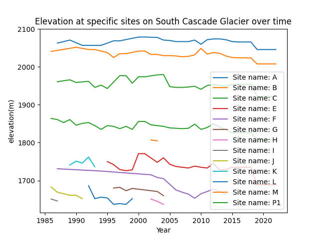
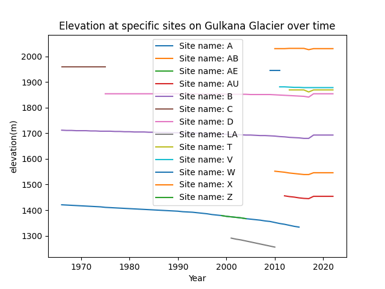
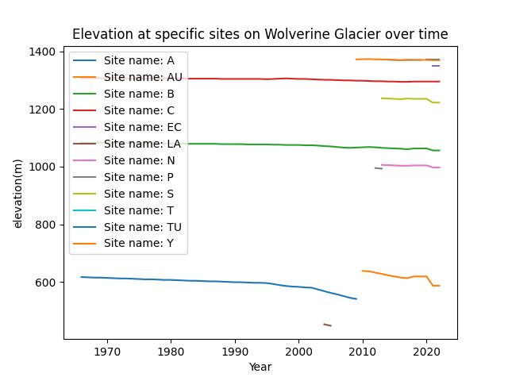
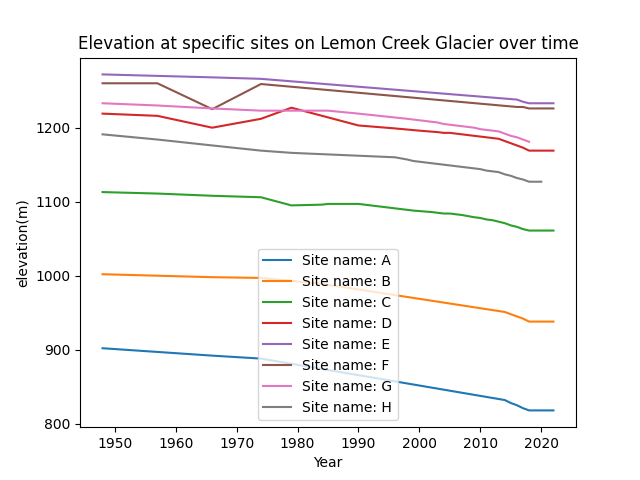

## Benchmark Glaciers and Machine Learning

I applied machine learning techniques to investigate the mass balance trends of  different "benchmark" glaciers
over the last half-century.

***

## Introduction 

I’m working on building a methodology to investigate glaciers and deglaciation using remote sensing data. I plan to use a combination of both MODIS & Landsat/Sentinel data to have decent spatial and temporal resolutions in my study. I’m using the [USGS benchmark glacier project](https://www.usgs.gov/programs/climate-research-and-development-program/science/usgs-benchmark-glacier-project) as a starting point. These five glaciers in Alaska, Washington, and Montana have been monitored in-situ for the past half-century. The USGS releases a wide variety of data on these benchmark glaciers including mass balance measures, preprocessed aerial photographs, and glacier extent shapefiles. My goal is to help formulate a remote sensing methodology to inventory glaciers and deglaciation on a larger scale. In-situ monitoring is simply not feasable on a global scale, so remote sensing methods are needed to study the vast majority of Earth's glaciers. I am particularly interested in answering questions about the downstream effects of melting glaciers and plan to investigate this niche for my master’s project this coming year. This machine learning project serves as a starting point for incorperating machine learning methods into my project. While this project uses benchmark glacier mass balance data, I do hope to apply some of my recently learned machine learning skills into my remote sensing methods in the future.

Machine learning could allow time series prediction with autoregression. Autoregression would potentially allow the prediction of future glacier mass balance based on past mass balance time series data. I wanted to try out using an ARIMA model (or autoregressive integrated moving average), as it is a powerful supervised regression tool which allows the prediction of future values based on past values in a time series. 

In the end, applying the ARIMA model to this benchmark glacier data did not prove to be useful. Error values ended up being very large. In comparison to a simple linear regression model, the ARIMA model performed significantly worse. For the Gulkana glacier, the average error (calculated by dividing root mean squared error by mean test data values) for the linear regression of 14.6% was much lower than the average error for ARIMA at 70.6%. Neither error is ideal, but this comparison demonstrates that the ARIMA model is not useful in this situation.

## Data
Glacialogical data is released by the USGS for its 5 different benchmark glaciers. This project focuses on the four benchmark glaciers with the greatest number of data entries. Most of the ARIMA analysis is done on only the Wolverine and Gulkana glaciers as only these datasets have more than the reccomended minium of 50 entries for to run the ARIMA model.

To briefly visualize what the data looks like in each of the four glacier data files, I have plotted the recorded elevation (a proxy for mass balance) at each in-situ measuring site on the South Cascade Glacier over time. Figures for the other glaciers can be found in the "Additional Figures" section below.

{: width="500" }
Figure 1 (above) shows the measured elevation at each of the in-situ sites on South Cascade Glacier


#### Data used in the project is linked here:
[Gulkana Glacialogical Data](https://drive.google.com/file/d/1KciRCT_4cVXChv1nSc8eOxBHqwMQuBno/view?usp=sharing)

[Wolverine Glacialogical Data](https://drive.google.com/file/d/1xfuH47yD8KlLSmyM8nRQJvXeM015vO0Y/view?usp=sharing)

[Lemon Creek Glacialogical Data](https://drive.google.com/file/d/1u-vBvsn2Pz2mM3EJPyptl-6nDYzsBNDV/view?usp=sharing)

[South Cascade Glacialogical Data](https://drive.google.com/file/d/1bJiP9jKUJTpS_rrZukeZ84h8QLUTsnO8/view?usp=sharing)


## Modelling

Here are some more details about the machine learning approach, and why this was deemed appropriate for the dataset. 

The model might involve optimizing some quantity. You can include snippets of code if it is helpful to explain things.

```python
from sklearn.ensemble import ExtraTreesClassifier
from sklearn.datasets import make_classification
X, y = make_classification(n_features=4, random_state=0)
clf = ExtraTreesClassifier(n_estimators=100, random_state=0)
clf.fit(X, y)
clf.predict([[0, 0, 0, 0]])
```

This is how the method was developed.

## Results

Figure X shows... [description of Figure X].

## Discussion

From Figure X, one can see that... [interpretation of Figure X].

## Conclusion

Here is a brief summary. From this work, the following conclusions can be made:
* first conclusion
* second conclusion

Here is how this work could be developed further in a future project.


## Additional Figures
{: width="500" }

{: width="500" }

{: width="500" }

## Code

My project code is available [here](https://colab.research.google.com/drive/1dhLpk-ZUXa-RG0jSgcaCqQ6c3OYZn3J8?usp=sharing)


## References


[back](./)

