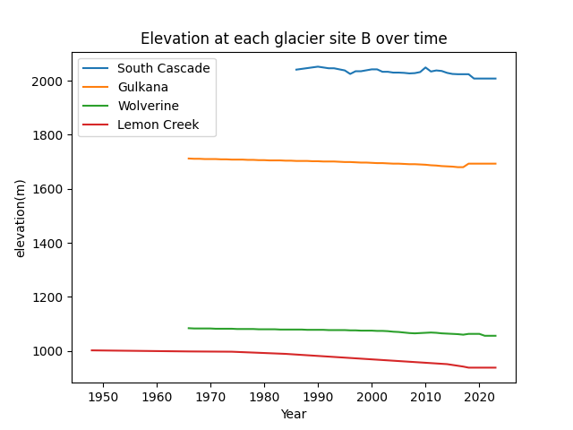
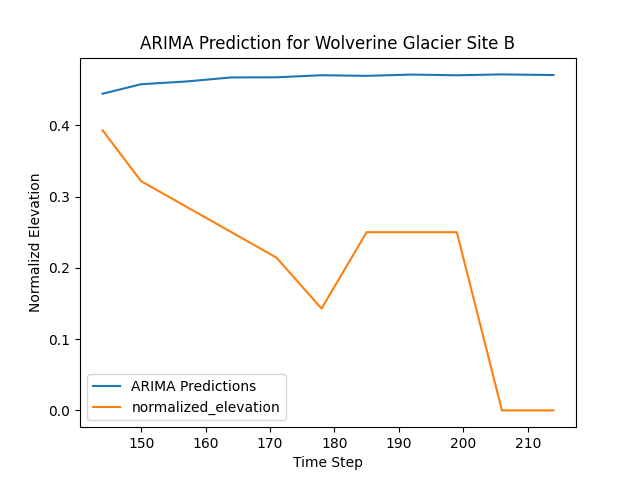
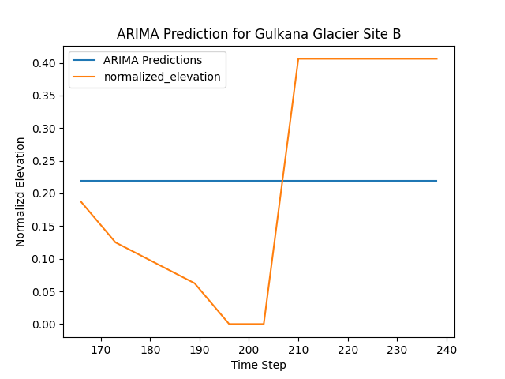
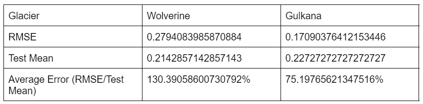

## Benchmark Glaciers and Machine Learning

I applied machine learning techniques to investigate the mass balance trends of  different "benchmark" glaciers
over the last half-century.

***

## Introduction 

I’m working on building a methodology to investigate glaciers and deglaciation using remote sensing data. I plan to use a combination of both MODIS & Landsat/Sentinel data to have decent spatial and temporal resolutions in my study. I’m using the [USGS benchmark glacier project](https://www.usgs.gov/programs/climate-research-and-development-program/science/usgs-benchmark-glacier-project) as a starting point. These five glaciers in Alaska, Washington, and Montana have been monitored in-situ for the past half-century [5]. The USGS releases a wide variety of data on these benchmark glaciers including mass balance measures, preprocessed aerial photographs, and glacier extent shapefiles. My goal is to help formulate a remote sensing methodology to inventory glaciers and deglaciation on a larger scale [5]. In-situ monitoring is simply not feasable on a global scale, so remote sensing methods are needed to study the vast majority of Earth's glaciers. I am particularly interested in answering questions about the downstream effects of melting glaciers and plan to investigate this niche for my master’s project this coming year. This machine learning project serves as a starting point for incorperating machine learning methods into my project. While this project uses benchmark glacier mass balance data, I do hope to apply some of my recently learned machine learning skills into my remote sensing methods in the future.

Machine learning could allow time series prediction with autoregression. Autoregression would potentially allow the prediction of future glacier mass balance based on past mass balance time series data. I wanted to try out using an ARIMA model (or autoregressive integrated moving average), as it is a powerful supervised regression tool which allows the prediction of future values based on past values in a time series. 

In the end, applying the ARIMA model to this benchmark glacier data did not prove to be useful. Error values ended up being very large. In comparison to a simple linear regression model, the ARIMA model performed significantly worse. For the Gulkana glacier, the average error (calculated by dividing root mean squared error by mean test data values) for the linear regression of 14.6% was much lower than the average error for ARIMA at 70.6%. Neither error is ideal, but this comparison demonstrates that the ARIMA model is not useful in this situation.

## Data
Glacialogical data is released by the USGS for its 5 different benchmark glaciers. This project focuses on the four benchmark glaciers with the greatest number of data entries. Most of the ARIMA analysis is done on only the Wolverine and Gulkana glaciers as only these datasets have more than the reccomended minium of 50 entries for to run the ARIMA model.

Before visualizing or modeling the glacialogical data, visualization was necessary. Each of the glaceir datasets was loaded as a pandas dataframe object to make the data easier to work with moving forward. 

```python
import pandas as pd
SC_data = pd.read_csv(SC_filepath)
W_data = pd.read_csv(W_filepath)
G_data = pd.read_csv(G_filepath)
LC_data = pd.read_csv(LC_filepath)

SC_df = pd.DataFrame(SC_data)
W_df = pd.DataFrame(W_data)
G_df = pd.DataFrame(G_data)
LC_df = pd.DataFrame(LC_data)
```

After the data for each glacier was loaded in as dataframes, the data needed to be grouped by "site_name." In the glacialogical data files, there are data from numerous collection sites. There is a column which indicates from which site the data in a given row come from. While there are potentially better methods for aggregating the data from these different sites, each site on each glacier was kept separate during this project for the sake of simplicity. The data were grouped by "site_name" as shown below:

```python
SC_groupedDF = SC_df.groupby('site_name')
SC_grouped_dataframes  = [group for _, group in SC_groupedDF]

W_groupedDF = W_df.groupby('site_name')
W_grouped_dataframes  = [group for _, group in W_groupedDF]

G_groupedDF = G_df.groupby('site_name')
G_grouped_dataframes  = [group for _, group in G_groupedDF]

LC_groupedDF = LC_df.groupby('site_name')
LC_grouped_dataframes  = [group for _, group in LC_groupedDF]
```

To briefly visualize what the data looks like in each of the four glacier data files, I plotted the recorded elevation (a proxy for mass balance) at each in-situ measuring site on the South Cascade Glacier over time. Figures for the other glaciers can be found in the "Additional Figures" section below.


Figure 1 (above) shows the measured elevation at each of the in-situ sites on South Cascade Glacier

When observing the figures, it becomes clear that the sites are not consistent with each other in terms of years used and number of samples collected. To once again simplify this project, only a single site would be used from each glacier. The main factor to decided which sites would be used was a breadth in the number of years a site was active. Each of the site Bs had a long range of years sampled compared to other sites on their respective glaciers, so all site Bs were chosen for consistency, even though this is most likely a coincidence. In a lengthier study moving beyond just machine learning methods, a different apporach for how to aggregate the values from the different sites should be used. It would be best to look to past literature on the Benchmark Glacier Project to get a sense of how this issue is usally resolved. The code to create a "Site B" subset for each benchmark glacier is as follows:

```python
# Dictionary to store dataframes for each site
SC_site_dataframes = {}
W_site_dataframes = {}
G_site_dataframes = {}
LC_site_dataframes = {}

# Iterate through groups and store dataframes
for site, group_df in SC_groupedDF:
    SC_site_dataframes[site] = group_df
for site, group_df in W_groupedDF:
    W_site_dataframes[site] = group_df
for site, group_df in G_groupedDF:
    G_site_dataframes[site] = group_df
for site, group_df in LC_groupedDF:
    LC_site_dataframes[site] = group_df

# Accessing individual dataframes for each selected site
SC_site_B_dataframe = SC_site_dataframes['B']
W_site_B_dataframe = W_site_dataframes['B']
G_site_B_dataframe = G_site_dataframes['B']
LC_site_B_dataframe = LC_site_dataframes['B']
```
Once each glacier Site B was isolated, they could all be plotted for comparison. In the following plot, it becomes apparent that the duration of each glacier's monitoring does not line up well with the others. Nor do the elevations, tho this is expected as the elevtions are only a proxy for mass balance. Later, these elevations were normalized for consistency before models were run.



Figure 2 (above) outines the years in which each glacier had monitoring on its "Site B" and at which elevation the "Site B" point was at any given year

Finally, before the dataframes could be used in models, the elevation data needed to be normalised. This step was not exactly necessary for this project and these applications of machine learning, but normalizing data is generally a good practice when running machine learning models, so it is done here as follows:

```python
# Function to normalize data using min-max normalization
def min_max_normalize(data):
    return (data - data.min()) / (data.max() - data.min())

# Normalize elevation data using min-max normalization
SC_site_B_dataframe['normalized_elevation'] = min_max_normalize(SC_site_B_dataframe['elevation'])
W_site_B_dataframe['normalized_elevation'] = min_max_normalize(W_site_B_dataframe['elevation'])
G_site_B_dataframe['normalized_elevation'] = min_max_normalize(G_site_B_dataframe['elevation'])
LC_site_B_dataframe['normalized_elevation'] = min_max_normalize(LC_site_B_dataframe['elevation'])

```
Each elevation value in each glacier Site B Subset is converted to a value between 0 and 1. While this project never compared glacier or sites with each other, normalization is an essential first step in futre comparability. 

#### Datasets used in the project are linked here:
[Gulkana Glacialogical Data](https://drive.google.com/file/d/1KciRCT_4cVXChv1nSc8eOxBHqwMQuBno/view?usp=sharing)

[Wolverine Glacialogical Data](https://drive.google.com/file/d/1xfuH47yD8KlLSmyM8nRQJvXeM015vO0Y/view?usp=sharing)

[Lemon Creek Glacialogical Data](https://drive.google.com/file/d/1u-vBvsn2Pz2mM3EJPyptl-6nDYzsBNDV/view?usp=sharing)

[South Cascade Glacialogical Data](https://drive.google.com/file/d/1bJiP9jKUJTpS_rrZukeZ84h8QLUTsnO8/view?usp=sharing)


## Modeling

One method to forecast timeseries is ARIMA or Autoregressive Integrated Moving Average. ARIMA builds upon autoregression and incorperates differencing (integrated) and moving average [1]. It is a supervised regression technique that allows the prediction of future trends from past data [4]. Since glacier mass is a trend that often shows cycles, I thought it would be interesting to try an ARIMA modeling approach to both better understand past deglaciation and to see if in-situ elevation measurements alone are enough to predict future glacial melt.

Before running and fitting the ARIMA model, it is important to decide on model parameters. The parameters needed for the ARIMA model are p, d, and q. AS explained by "Introduction to ARIMA," p, which contributes to the autoregression, is defined as "the number of autoregressive terms," d , which contributes to the integration, is defined as "the number of nonseasonal differences needed for stationarity" and q, which contributes to the moving average, is defined as "the number of lagged forecast errors in the prediction equation"[3]. The auto_arima function from the pmdarima library is able to help decide the best order for an ARIMA model given a dataset; it employs a function to estimate how well each order (with different p, d, and q values) would work for the ARIMA model [4]. In this case, getting a sense of the optimal order from the auto_arima is necessary to run the ARIMA model without iterative trial and error. The code for this function is as follows:

```python
#Figure out order
from pmdarima import auto_arima
stepwise_fit = auto_arima(G_site_B_dataframe['normalized_elevation'], trace=True, suppress_warnings=True)

stepwise_fit.summary()

#Wolverine best model: (3,1,1)
#Gulkana best model: (0,1,0)
```

At this point inthe project, the scope was narrowed once again to include only the Site B elevation values from Wolverine and Gulkana glaciers, as these were the only datasets to include the optimal 50+ entries to run the ARIMA model [2]. The best (p,d,q) fits for the Wolverine and Gulkana glaciers were (3,1,1) and (0,1,0) respectively

Before running the model, the data must be split into training and test data. Using the guidlines from a helpful post on Stack Overflow, it was determined that using 20% of the data as the test group would be ideal for the ARIMA model [2]. 20% of both the Wolverine Glacier and the Gulkana Glacier Site B Observations ended up being 11. It seems like these glaciers were more consitently monitored than some of the others in the benchmark ensemble. The data for each of the two Site Bs were split into training and testing groups as follows:

```python
print("SC: ",(len(SC_site_B_dataframe))*0.2)
print("W: ",(len(W_site_B_dataframe))*0.2)
print("G: ",(len(G_site_B_dataframe))*0.2)
print("LC: ",(len(LC_site_B_dataframe))*0.2)

#the last 11 value will be testing data
trainW = W_site_B_dataframe.iloc[:-11]
testW = W_site_B_dataframe.iloc[-11:]
trainG = G_site_B_dataframe.iloc[:-11]
testG = G_site_B_dataframe.iloc[-11:]
```

After the data were sorted into training and testing groups, the ARIMA model could be trained. The ARIMA function from the statsmodels library was used here as followed for each of the two glaciers:


```python
from statsmodels.tsa.arima.model import ARIMA

#Train the model -- Wolverine
modelW=ARIMA(trainW['normalized_elevation'],order=(3,1,1)) #best model order comes from the auto_arima above
modelW=modelW.fit()
modelW.summary()

#Train the model -- Gulkana
modelG=ARIMA(trainG['normalized_elevation'],order=(0,1,0)) #best model order comes from the auto_arima above
modelG=modelG.fit()
modelG.summary()
```

Finally, using the test datasets that were initially set aside, the model could be tested for its effectiveness. Predictions were made on the test set as follows:

```python
#Predictions for Wolverine
startW=len(trainW)
endW=len(trainW)+len(testW)-1
predW=modelW.predict(start=startW,end=endW,typ='levels').rename('ARIMA Predictions')

#Predictions for Gulkana
startG=len(trainG)
endG=len(trainG)+len(testG)-1
predG=modelG.predict(start=startG,end=endG,typ='levels').rename('ARIMA Predictions')
```

## Results

Once predictions were made using the testing dataset, the last 11 terms of the normalized elevation could be plotted alongside the ARIMA predicted values for comparison. The Wolverine Glacier predictions completely missed the mark; they are consitently higher and show the wrong direction trend (positive instead of negative) while the Gulkana Glacier predictions seemed to follow the average normalized elevation value, they do not show the intracaies of the cyclical melt. The plots for each glacier follow:



Figure 3 (above) shows the predicted ARIMA model values for the last 11 time steps compared to the actual normalized elevation values for Site B on Wolverine Glacier



Figure 4 (above) shows the predicted ARIMA model values for the last 11 time steps compared to the actual normalized elevation values for Site B on Gulkana Glacier

In order to better quantify how well (or poorly, in this case) the model worked and fit the data, a combination of RMSE (root mean square error) and average error were used. The following table summarized each of the values for each of the two models:



Table 1 (above) compares accuracy measurements for the Gulkana and Wolverine ARIMA models


## Discussion

From Figure X, one can see that... [interpretation of Figure X].

## Conclusion

Here is a brief summary. From this work, the following conclusions can be made:
* first conclusion
* second conclusion

Here is how this work could be developed further in a future project.


## Additional Figures


Figure A (above) shows the measured elevation at each of the in-situ sites on Gulkana Glacier


Figure B (above) shows the measured elevation at each of the in-situ sites on Wolverine Glacier


Figure C (above) shows the measured elevation at each of the in-situ sites on Lemon Creek Glacier

## Code

My project code is available [here](https://colab.research.google.com/drive/1dhLpk-ZUXa-RG0jSgcaCqQ6c3OYZn3J8?usp=sharing)


## References

1. [Autoregressive Integrated Moving Average (ARIMA) Prediction Model](https://www.investopedia.com/terms/a/autoregressive-integrated-moving-average-arima.asp#:~:text=An%20autoregressive%20integrated%20moving%20average%2C%20or%20ARIMA%2C%20is%20a%20statistical,values%20based%20on%20past%20values.)

2. [Guidance on Splitting Training and Testing Data](https://stackoverflow.com/questions/72544161/how-many-training-and-testing-data-should-i-use)

3. [Introduction to ARIMA: nonseasonal models](https://people.duke.edu/~rnau/411arim.htm#:~:text=A%20nonseasonal%20ARIMA%20model%20is,errors%20in%20the%20prediction%20equation.)

4. [Time Series Forecasting With ARIMA Model in Python for Temperature Prediction](https://medium.com/swlh/temperature-forecasting-with-arima-model-in-python-427b2d3bcb53)

5. [USGS Benchmark Glacier Project](https://www.usgs.gov/programs/climate-research-and-development-program/science/usgs-benchmark-glacier-project)

[back](./)

